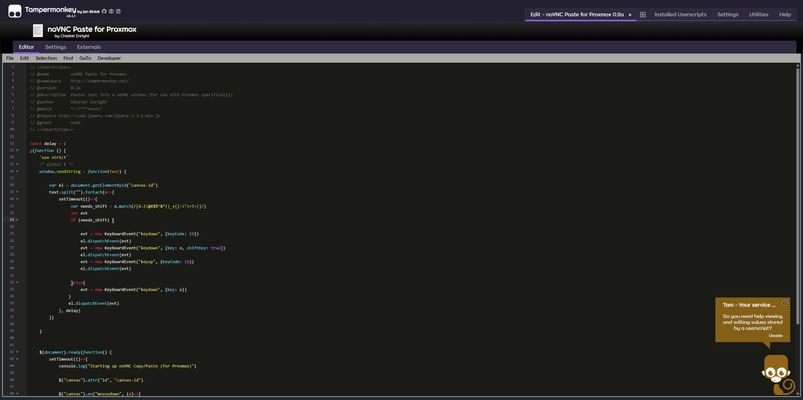
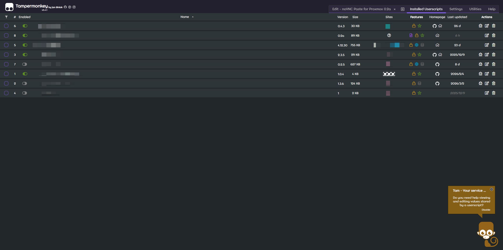
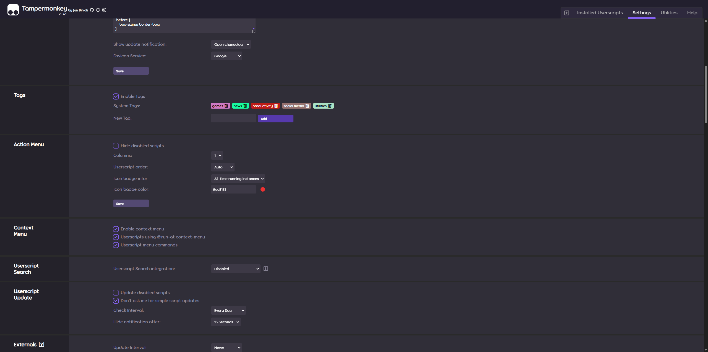
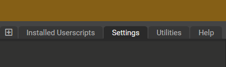
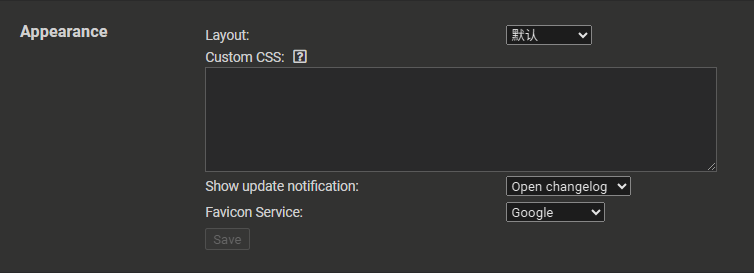

# TamperMonkey CSS Override

A TamperMonkey Custom CSS that allows you to beautify all the TamperMonkey interfaces.

> **Note**: This override is designed to work only with "dark"/"light" theme.
>
> It may not work properly with the "darker" theme currently.

## Usage

Open TamperMonkey settings and locate the script settings:

[Copy](./index.css) and add the custom CSS code in the `Appearance` section:

Remember to save your changes. Click the save button in the bottom left corner of `Appearance`.

## TODO

- Encapsulate color variables to make it easier to customize the theme.
- Add support for light themes and "darker" theme.
- Nest the CSS rules to make it more organized and easier to maintain.
